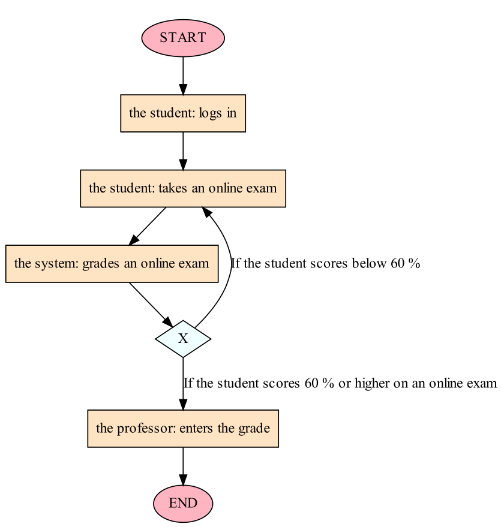
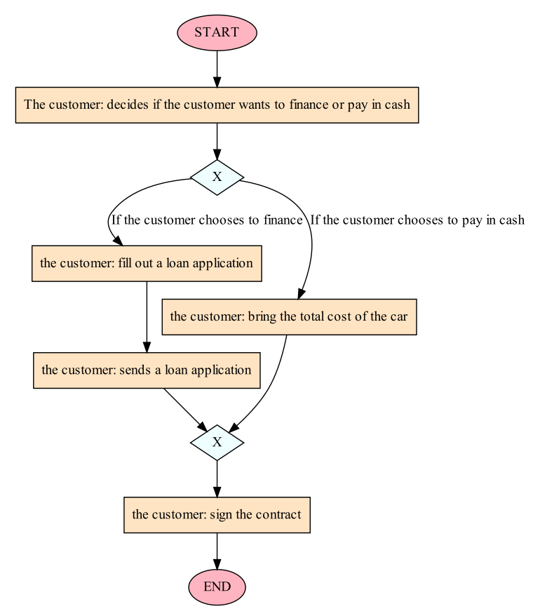
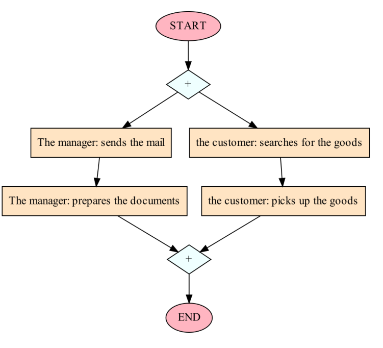
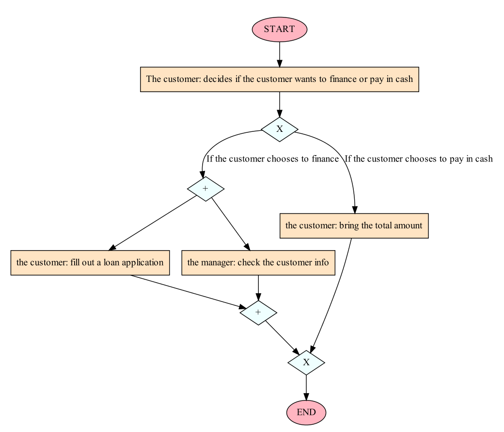
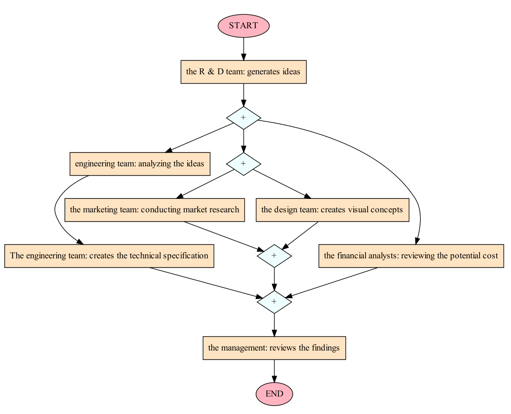
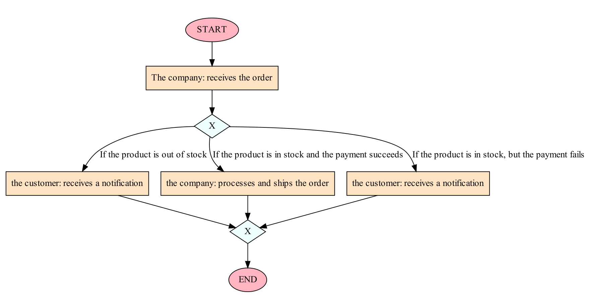

# Process visualizer

Это приложение, которое преобразует текстовые описания процессов в упрощённые диаграммы BPMN. Приложение использует инструменты обработки естественного языка, такие как spaCy, и доработанную модель BERT для классификации токенов, чтобы извлекать ключевую информацию из текста. Кроме того, приложение использует модели DeepSeek, такие как deepseek-ai/deepseek-llm-7b-chat, для выполнения сложных задач, связанных с анализом описаний процессов. Наконец, для создания итоговой диаграммы используется Graphviz. GRAPHVIZ РАБОТАЕТ КРИВО. МОЖНО ЕГО ВООБЩЕ УБРАТЬ ОСТАВИВ НА output:bpmn_final_structure.json

Приложение поддерживает следующие элементы BPMN:

* tasks - Задачи
* exclusive gateways - эксклюзивные шлюзы  И  
* parallel gateways - Параллельные шлюзы  ИЛИ 
* start and end events  Начало и конец 

## How to run

0. 3.9<Python<=3.10 the best 3.10
1. Clone the rep
2. Download and install deepseek-ai/deepseek-llm-7b-chat   git lfs install /  git clone https://huggingface.co/deepseek-ai/deepseek-llm-7b-chat
3. Download and install [Graphviz](https://graphviz.org/download/), add Graphviz to the system PATH 
4. Install the required dependencies: `pip install -r requirements.txt`
5. The complete environment list  requirements_FULL.txt
6. Download the necessary spaCy models:  
    `python -m spacy download en_core_web_sm`  
    `python -m spacy download en_core_web_md`
7. Create an .env file in the root of the `src` folder with your OpenAI API key as an environment variable: `HF_TOKEN = "hf_****************************"`
8. Run the script by running `python .\src\main.py -t "Textual description of the process"`. Alternatively, you can run the script by providing a path to a file containing the textual description of the process: `python .\src\main.py -f <path_to_file.txt> `

## Example inputs and outputs

### Example #1

*The process begins when the student logs in to the university's website. He then takes an online exam. After that, the system grades it. If the student scores below 60%, he takes the exam again. If the student scores 60% or higher on the exam, the professor enters the grade.*

  
<b>Show output</b>

  

---

### Example #2

*The customer decides if he wants to finance or pay in cash. If the customer chooses to finance, the customer will need to fill out a loan application. After that, the customer sends the application to the bank. If the customer chooses to pay in cash, the customer will need to bring the total cost of the car to the dealership in order to complete the transaction. After the customer has chosen to finance or pay in cash, the customer must sign the contract before the transaction is completed.*

  
<b>Show output</b>

  

---

### Example #3

*The manager sends the mail to the supplier and prepares the documents. At the same time, the
customer searches for the goods and picks up the goods.*

  
<b>Show output</b>

  

---

### Example #4

*The customer decides if he wants to finance or pay in cash. If the customer chooses to finance, two activities will happen in parallel: the customer will fill out a loan application and the manager will check the customer's info. If the customer chooses to pay in cash, the customer will need to bring the total amount to the dealership in order to complete the transaction.*

  
<b>Show output</b>

  

---

### Example #5

*The process starts when the R&D team generates ideas for new products. At this point, 3 things occur in parallel: the first thing is the engineering team analyzing the ideas for feasibility. The engineering team also creates the technical specification. The second path involves the marketing team conducting market research for the ideas. At the same time, the design team creates visual concepts for the potential products. The third path sees the financial analysts reviewing the potential cost of the ideas. Once each track has completed its analysis, the management reviews the findings of the analysis.*

  
<b>Show output</b>

  

---

### Example #6

*The company receives the order from the customer. If the product is out of stock, the customer receives a notification that the order cannot be fulfilled. If the product is in stock and the payment succeeds, the company processes and ships the order. If the product is in stock, but the payment fails, the customer receives a notification that the order cannot be processed.*

  
<b>Show output</b>

  

